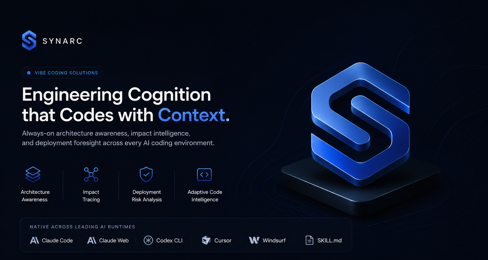
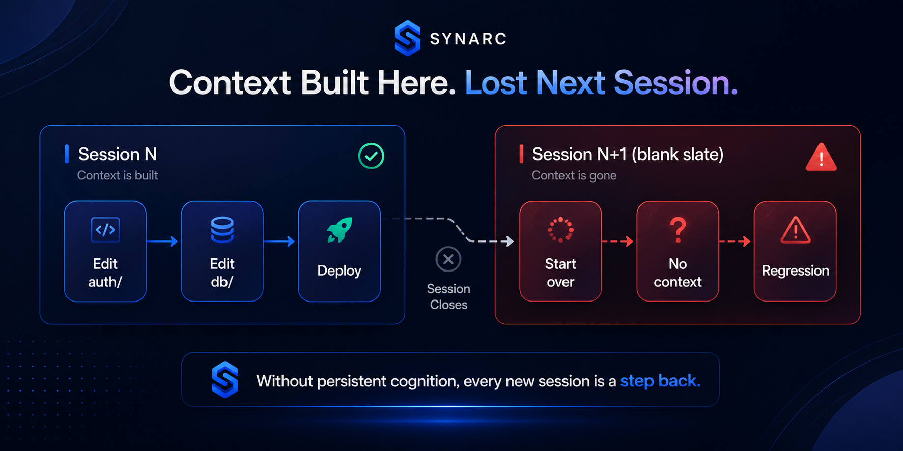
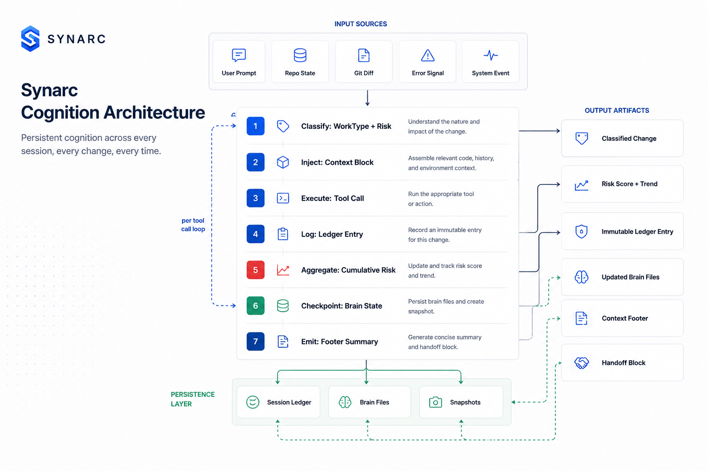
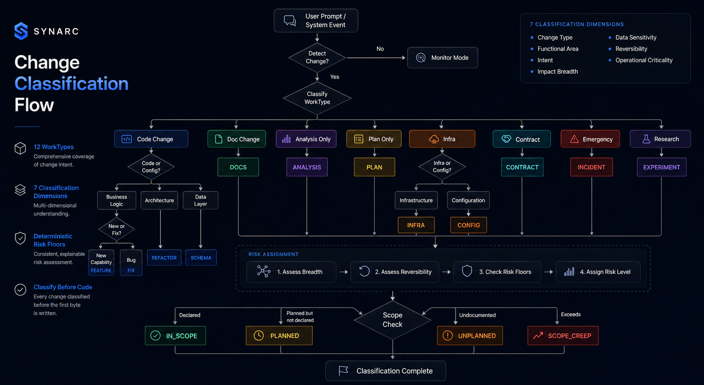
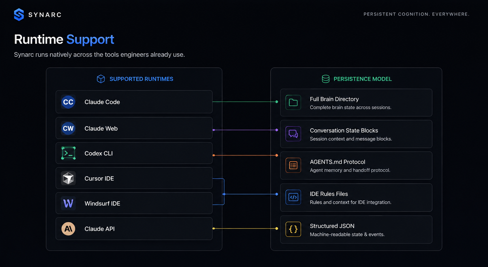
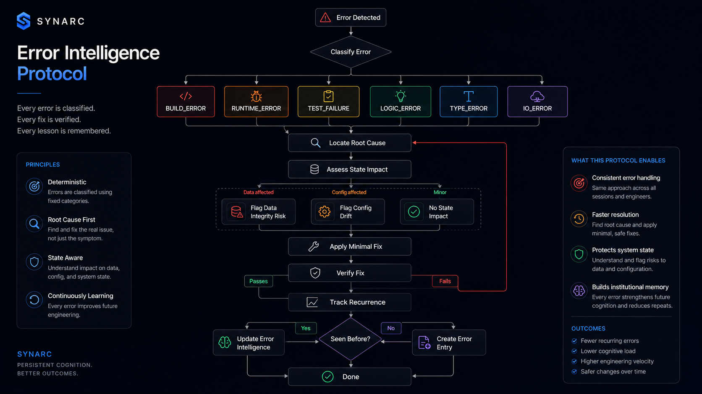
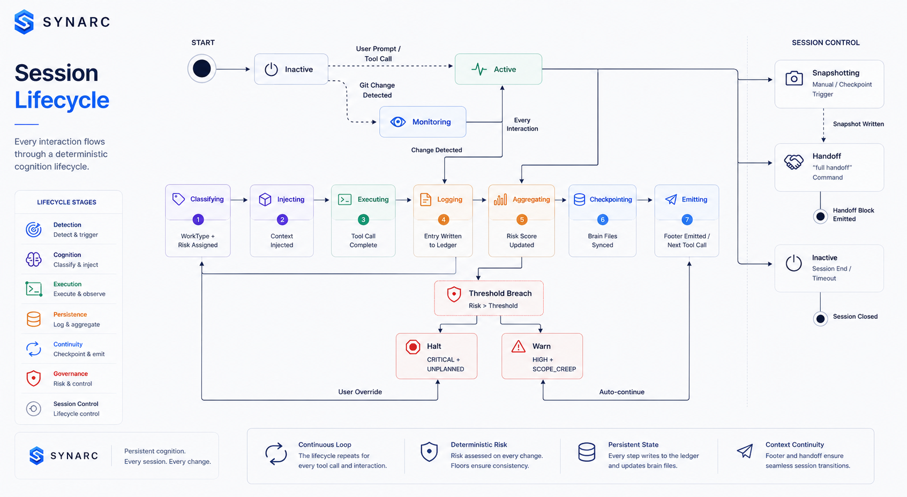
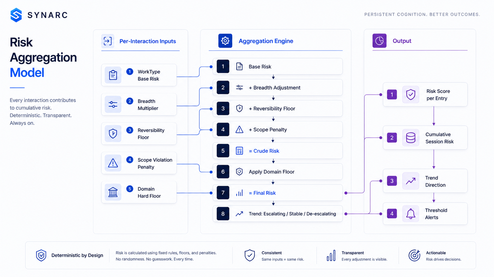
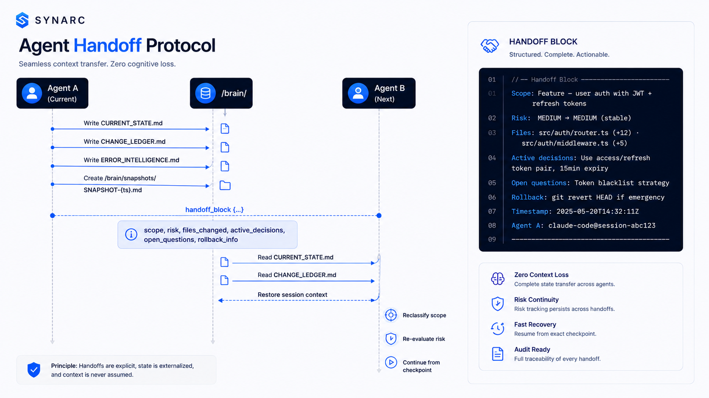

# Synarc - Autonomous Engineering Intelligence Runtime




[](https://github.com/upflame-labs/synarc/releases)
[](https://github.com/upflame-labs/synarc)
[](LICENSE)
[](https://github.com/upflame-labs/synarc)
[](https://github.com/upflame-labs/synarc)
[](https://github.com/upflame-labs/synarc)
[](https://owasp.org/www-project-top-10-for-large-language-model-applications/)
[](https://github.com/upflame-labs/synarc/tree/main/plugins/synarc/skills/references)
[](https://github.com/upflame-labs/synarc)
[](https://github.com/upflame-labs/synarc)

Build fast with AI, but ship with engineering discipline. Synarc transforms raw vibe coding into context-governed agentic execution by preserving architectural memory, enforcing repository awareness, and maintaining decision continuity across sessions.

> [!IMPORTANT]
> Production - always-on, zero-configuration engineering cognition runtime. No breaking changes in minor versions.

Change classification, risk tracking, context injection, and session continuity for AI coding environments. One SKILL.md, any runtime.

---

## The Problem

Your AI coding agent reads files, edits code, runs commands, and ships changes to production. Every interaction creates change, and in vibe coding workflows those changes compound faster than context can keep up. Five rapid edits become fifty hidden assumptions spread across your codebase. Architectural intent fades, reasoning fragments across prompts, and what feels like velocity quietly turns into system drift.

When something breaks, the problem is rarely the final change itself. The real failure is losing the chain of reasoning behind it. Engineering teams are left trying to reconstruct what changed, why the agent made that decision, and which contracts, integrations, or architectural guarantees were silently violated along the way.

This is the core failure of vibe coding. AI coding agents optimize for generation speed, but production systems depend on context continuity. Without persistent context, every session risks architectural drift, repeated regressions, duplicate implementations, and unstable deployments.

The faster AI writes code, the more dangerous context loss becomes. That is the gap Synarc solves.

When something breaks, every engineering team needs answers to three critical questions:

**1. What changed?** An agent that edited `auth/router.ts`, `src/middleware.ts`, and `db/migrations/` might have touched authentication, request handling, and the database schema. Did it intend to? Was the scope declared?

**2. Is this change safe?** A three-line diff in `payment/processor.ts` changes circuit breaker logic. Lines of code do not correlate with risk. Every change needs a risk assessment - not by effort, by impact.

**3. What happens when I close this session?** The agent holds your project's current state in its context window. When the session ends, that state is gone. The next session starts from zero. Every decision, every risk, every architectural assumption - lost.



Prompt-level safety ("please track what you change") is not a control surface. It is a polite request to a stochastic system. OWASP LLM01:2025 states this explicitly: deterministic controls must exist outside the prompt.

Synarc does not ask agents to behave. It interposes deterministic classification, logging, and risk assessment at every tool call - before the model's intent reaches the wire. Changes the cognition layer flags as UNPLANNED or CRITICAL are surfaced before they execute.

---

## Architecture



Every layer runs on every tool call. Classify → Inject → Execute → Log → Aggregate → Checkpoint → Emit. ~50-100ms overhead. Prevents misclassifications, scope violations, and unrecoverable changes. The architecture is **runtime-agnostic** - the same 7-step pipeline executes identically across Claude Code, Codex CLI, Cursor, Windsurf, and any other AI coding tool.

---

## Change Classification Flow



12 WorkTypes. 7 classification dimensions. Deterministic risk floors. Every change classified before the first byte is written.

---

## Quick Start

**Prerequisites:** Any AI coding runtime (Claude Code, Codex CLI, Cursor, Windsurf).

Synarc activates automatically. Zero configuration.

```text
User: "Review this diff and tell me if it's safe to deploy"

Synarc automatically:
✓ Maps impacted services
✓ Detects contract violations
✓ Scores deployment risk
✓ Flags rollback hazards
✓ Produces mitigation strategy
```

### Session start - provide context

```text
Project: Node.js 20 REST API with Express + PostgreSQL + Redis
Scale: MEDIUM - team of 4, ~15k LOC, 6 modules
Modules: auth, users, tasks, projects, notifications, infra
Today's task: [describe what you want to do]
```

### Commands

| Command | Response |
|---------|----------|
| `what did we change?` | Full session ledger |
| `summarize this session` | Cognitive summary |
| `is this safe to deploy?` | Risk delta + explicit YES/NO |
| `what tests are missing?` | All unfilled test gaps |
| `generate a snapshot` | `/brain/snapshots/` entry |
| `full handoff` | Agent handoff block + brain updates |
| `run quality gates` | All gates PASS/FAIL report |

### CLI interaction

```text
> Classify: ANALYSIS | Risk: INFO | Scale: auto
✓ Pre-write check: PASS | Scope: in-bounds | Risk: MEDIUM

> what did we change?
── Session Ledger ──
[14:00] FEATURE | auth/router.ts (+12, -3) | MEDIUM | IN_SCOPE
[14:05] FIX    | auth/middleware.ts (+5, -0) | LOW | IN_SCOPE
Aggregate: MEDIUM (stable)
─────────────────────
```

Full walkthrough: [docs/QUICKSTART.md](docs/QUICKSTART.md)

---

## Installation

### Claude Code (Recommended)

```bash
# Install from UpFlame Marketplace
/plugin install upflame/synarc

# Verify
> Classify: ANALYSIS | Risk: INFO | Scale: auto
```

Synarc auto-detects `/brain/` or `.claude/` directories. Full brain directory, hooks, and session continuity enabled. The plugin registers automatically - no manual configuration needed.

---

### Manual Installation (Any Runtime)

```bash
git clone https://github.com/upflame/Synarc.git
cd Synarc
```

Then point your runtime to `plugins/synarc/skills/SKILL.md`:

| Runtime | Location |
|---------|----------|
| Claude Code | `/sk: install plugins/synarc/skills/SKILL.md` or copy to `~/.claude/skills/` |
| Codex CLI | Copy `SKILL.md` to repo root as `AGENTS.md` |
| Cursor IDE | Copy `SKILL.md` to `.cursor/rules/synarc.mdc` |
| Windsurf IDE | Copy `SKILL.md` to `.windsurfrules` |
| Claude Web / API | Paste `SKILL.md` contents into system prompt or project knowledge |

---

## Runtime Support




| Runtime | Persistence | Detection Signal | Injection Level | Brain Dir |
|---------|-------------|-----------------|-----------------|-----------|
| Claude Code | Full brain directory + hooks | `/brain/` or `.claude/` exists | STANDARD + COMPACT per tool | Yes |
| Claude Web | Conversation state blocks | Filesystem inaccessible; chat-only | COMPACT per interaction | No |
| Codex CLI | AGENTS.md protocol | `AGENTS.md` in repo root | STANDARD at session start | Via AGENTS.md |
| Cursor IDE | IDE rules protocol | `.cursor/rules` detected | COMPACT per file write | Limited |
| Windsurf IDE | IDE rules protocol | `.windsurfrules` detected | COMPACT per file write | Limited |
| Claude API | Structured JSON | API call with `skill_id` | STANDARD via `context` field | Via API |

---

## Error Intelligence Protocol




6-step protocol on every FIX: **Classify → Locate → Assess → Apply → Verify → Track**. Every error becomes a permanent entry in `/brain/ERROR_INTELLIGENCE.md` - past errors inform future fix strategies.

---

## Session Lifecycle



Sessions persist across interruptions. Ledger survives context resets. Handoff protocol enables seamless agent-to-agent transfer.

---

## Risk Aggregation Model




| Component | Rule |
|-----------|------|
| Base Risk | Derived from WorkType (FEATURE=MEDIUM, FIX=LOW, SCHEMA=HIGH, INCIDENT=CRITICAL) |
| Breadth Multiplier | SINGLE_FILE = 0, MULTI_FILE = +1 level, CROSS_SERVICE = +2, CROSS_BOUNDARY = +2 |
| Reversibility Floor | REVERTIBLE = no change, PARTIAL = min LOW, IRREVERSIBLE = min MEDIUM |
| Scope Violation Penalty | UNPLANNED = +1 level, SCOPE_CREEP = +2 levels |
| Domain Hard Floor | Auth/payments = min HIGH, Schema changes = min CRITICAL |
| Cumulative Trend | Last 5 entries weighted; escalating = warning, stable = OK, de-escalating = recovery |

---

## Scale Adaptation

| Scale | Threshold | Tracking Depth | Injection | Checkpoints | Brain Files |
|-------|-----------|----------------|-----------|-------------|-------------|
| NANO | 1 file, 1 purpose | WorkType + risk only | SILENT | None | None |
| MICRO | 2-10 files | CURRENT_STATE.md | COMPACT | On significant changes | CURRENT_STATE.md |
| SMALL | <5k LOC, 1-5 modules | Full brain directory | STANDARD | Per task | All brain files |
| MEDIUM | 5k-50k LOC, team | Full ledger | STANDARD | Per change set | All + CHANGE_LOG.md |
| LARGE | 50k-500k LOC, multi-service | Service-boundary tracking | FULL | Per service boundary | All + service maps |
| ENTERPRISE | >500k LOC, regulated | Compliance audit trail | FULL + pre-write | Per mutation | All + audit log |

Auto-detected. Zero configuration. Transitions are seamless - Synarc scales up as your project grows without changing a single line of configuration.

---

## Quality Gates


Every interaction passes through these gates before execution.

Zero-tolerance: no execution before classification, no invented context, no missing tests on fixes, no unabsorbed unplanned scope.

---

## Agent Handoff Protocol



---

## Capabilities

### Change Classification

Every interaction classified along 7 dimensions:

| Dimension | Values | Purpose |
|-----------|--------|---------|
| WorkType | FEATURE · FIX · REFACTOR · SCHEMA · CONTRACT · CONFIG · INFRA · INCIDENT · EXPERIMENT · DOCS · ANALYSIS · PLAN | What kind of work |
| Risk Level | CRITICAL · HIGH · MEDIUM · LOW · INFO | Safety assessment |
| Breadth | SINGLE_FILE · MULTI_FILE · CROSS_SERVICE · CROSS_BOUNDARY | Impact radius |
| Reversibility | REVERTIBLE · PARTIAL · IRREVERSIBLE | Rollback difficulty |
| Scope Alignment | IN_SCOPE · PLANNED · UNPLANNED · SCOPE_CREEP | Intent match |
| Urgency | NORMAL · HIGH · BLOCKING · EMERGENCY | Timeline pressure |
| Confidence | CERTAIN · LIKELY · UNCERTAIN · CONTRADICTED | Certainty of classification |

### Context Injection

| Level | Contents | Token Cost | When Used |
|-------|----------|------------|-----------|
| COMPACT | Scale + risk + session ID | ~50 tokens | Every tool call |
| STANDARD | + Scope boundary + recent ledger + active constraints | ~200 tokens | Session start, scope changes |
| FULL | + Architecture context + service map + all open risks | ~500 tokens | Large projects, cross-boundary changes |

### Session Ledger

Every interaction produces an immutable ledger entry:

```text
[2026-05-26 14:00:00] FEATURE | MEDIUM | IN_SCOPE | REVERTIBLE
  → src/auth/router.ts (+12, -3)
  → src/auth/middleware.ts (+5, -0)
  → Aggregate risk: MEDIUM (escalated from LOW)
```

`/brain/CHANGE_LEDGER.md` persists across sessions. `CHANGE_LOG.md` compresses for context efficiency. Checkpoints enable rollback to any prior state.

### Language Rules (S14)

Prohibited across all output:

| Category | Examples |
|----------|----------|
| False precision | "We'll improve iteratively" · "Continuously enhance" |
| Vacuous hedging | "Should" · "Could" · "Might" · "Perhaps" · "Potentially" |
| Manager-speak | "Leverage" · "Holistic" · "Robust" · "Granular" · "Actionable" |
| Padding | "Firstly" · "In conclusion" · "It is worth noting" · "Please note" |
| Euphemisms | "Edge cases" for bugs · "Technical debt" for bad code |
| Unknown framing | "I don't have access" instead of stating actual capability |

Engineer-to-engineer: direct, precise, no filler.

---

## Adoption Readiness

| Criterion | Status |
|-----------|--------|
| Any project size | NANO to ENTERPRISE - auto-scale |
| Any runtime | Claude Code · Codex · Cursor · Windsurf · Claude API · Generic |
| Zero dependencies | Pure reference files + markdown |
| No build step | Drop in and run |
| No telemetry | Zero network calls |
| Deterministic | Same input → same classification |
| Audit trail | Immutable ledger + snapshots |
| Team portable | Commit /brain/ to repo |
| CI/CD ready | Works in headless/automation environments |
| Compliance ready | OWASP mapped, audit trail, risk floors |

---

## Security & Compliance

| Guard | Status |
|-------|--------|
| Sandboxed execution | Enabled |
| No network access | Verified |
| No filesystem write outside `/brain/` | Enforced |
| Deterministic activation | Validated |
| Safe fallbacks on protocol error | Configured |
| Rollback-safe protocol | Verified |
| Hash-verified integrity (SHA-256) | Active |
| Tamper protection | Enabled |
| Immutable skill routing | Active |

**Risk hard floors** - cannot be lowered:

| Domain | Minimum Risk | Reasoning |
|--------|-------------|----------|
| Auth, billing, payments, security | HIGH | Revenue, access, or trust impact |
| Schema change (remove/rename) | CRITICAL | Data integrity + migration complexity |
| Environment variable rename | CRITICAL | All deployments affected |
| Public API response change | HIGH | All consumers must adapt |
| Network / IAM config | CRITICAL | Security boundary change |
| INCIDENT response | CRITICAL | Production emergency |

**Compliance:** OWASP LLM01-LLM10 risk categories mapped with deterministic controls. Risk escalation ladder with 6 levels (0→5):
- **Level 0**: Normal workflow - all gates pass, risk stable
- **Level 1**: Escalating - 2+ MEDIUM in a row
- **Level 2**: Warning - HIGH unplanned scope
- **Level 3**: Alert - CRITICAL detected
- **Level 4**: Intervention - CRITICAL + UNPLANNED
- **Level 5**: Full stop - CRITICAL + INCIDENT + external notification

Classification across SDLC: Pre-dev → Development → Review → Pre-deploy → Post-deploy → Post-mortem.

---

## What Users Say

> "Synarc is the first system that makes me trust what my AI coding agent is doing. The risk aggregation caught a scope violation before it reached production." - CTO, fintech startup

> "We deployed Synarc across 4 teams using Claude Code. The handoff protocol alone saved us 3 hours per context switch." - Platform Engineer, e-commerce platform

> "The scale adaptation is what sold us. NANO for scripts, ENTERPRISE for our payment pipeline - same SKILL.md, zero config changes." - Lead Architect, SaaS company

> "I didn't realize how much context I was losing between sessions until I had Synarc's ledger. It's like having a senior engineer's memory." - Staff Engineer, enterprise SaaS

---

## Documentation

| Category | Links |
|----------|-------|
| Getting Started | [Quick Start](docs/QUICKSTART.md) · [Deployment Guide](docs/DEPLOYMENT.md) |
| Specifications | [change-taxonomy.md](plugins/synarc/skills/references/change-taxonomy.md) · [injection-protocol.md](plugins/synarc/skills/references/injection-protocol.md) · [session-tracking.md](plugins/synarc/skills/references/session-tracking.md) · [coding-agent.md](plugins/synarc/skills/references/coding-agent.md) · [project-scales.md](plugins/synarc/skills/references/project-scales.md) · [analysis-patterns.md](plugins/synarc/skills/references/analysis-patterns.md) · [testing-strategy.md](plugins/synarc/skills/references/testing-strategy.md) · [security-patterns.md](plugins/synarc/skills/references/security-patterns.md) |
| Architecture | [cognition-layer.md](plugins/synarc/skills/references/cognition-layer.md) · [schemas.md](plugins/synarc/skills/references/schemas.md) · [platform-adapters.md](plugins/synarc/skills/references/platform-adapters.md) |
| Reference | [SKILL.md](plugins/synarc/skills/SKILL.md) (entry point) · [negative-prompts.md](plugins/synarc/skills/references/negative-prompts.md) |
| Integrity | [integrity.json](.claude-plugin/integrity.json) (SHA-256 verified) |

---

## Important Notes

Synarc classifies every change, tracks every mutation, and enforces quality gates. It does not modify your code without classification. It does not bypass security controls. It does not require network access. All cognition is local to the runtime session.

If you use Synarc with third-party AI coding tools or services, review what data is shared with those services. Synarc itself makes no external network calls.

---

## License

MIT - see [LICENSE](LICENSE).

Built by [UpFlame](https://github.com/upflame).